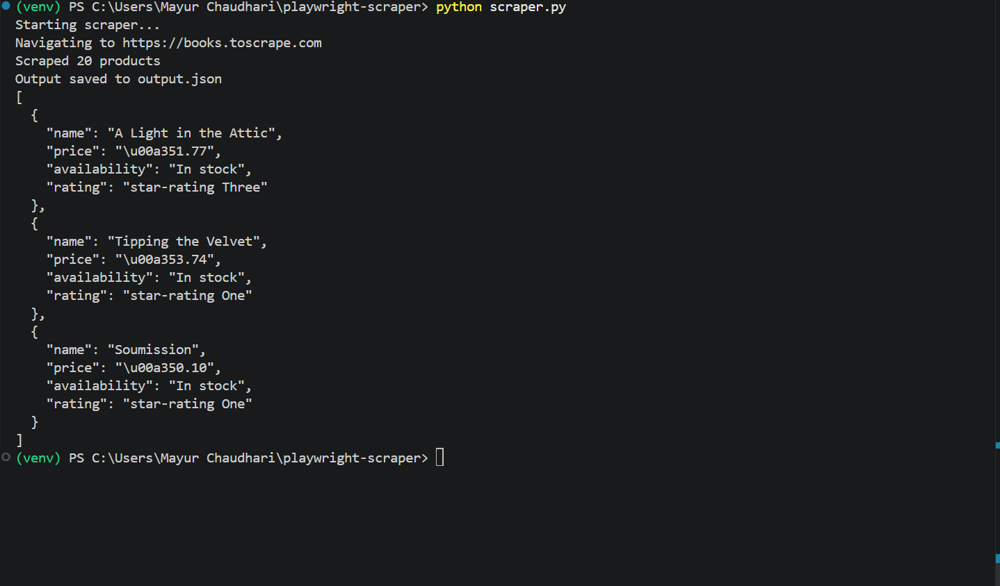
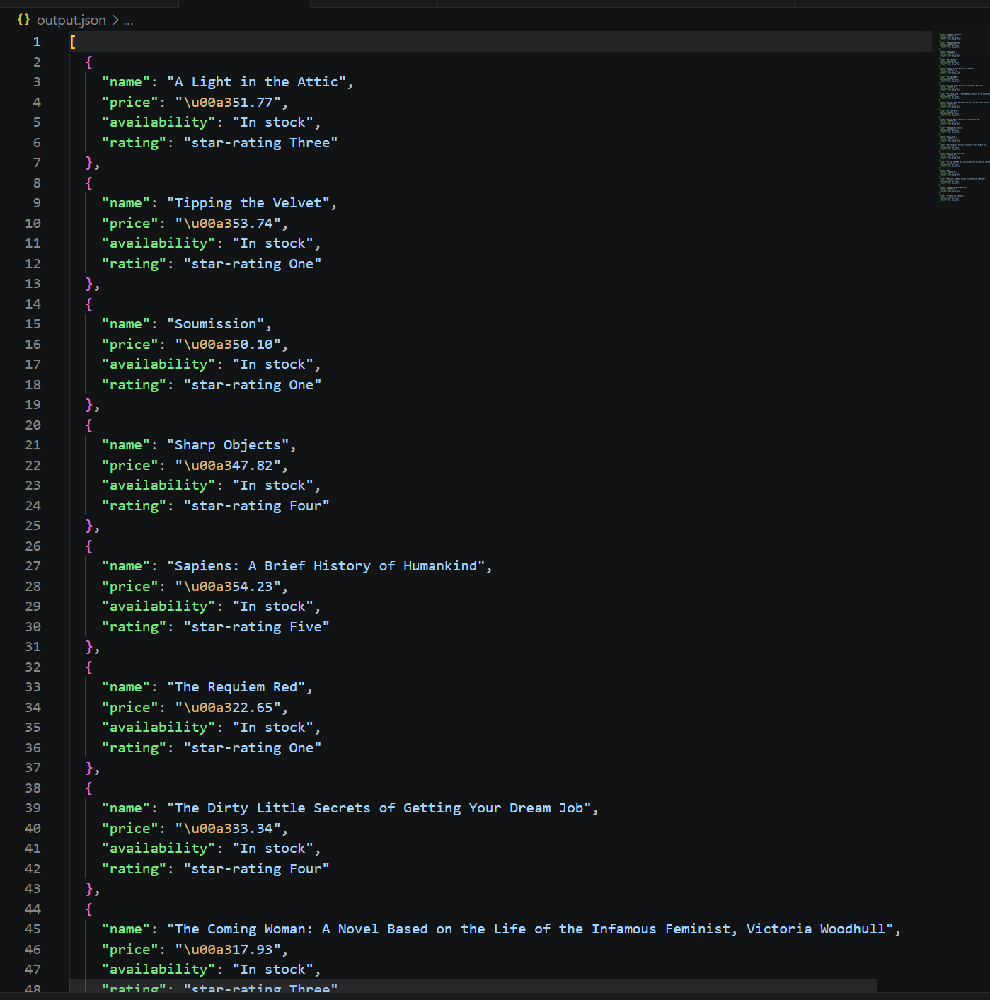
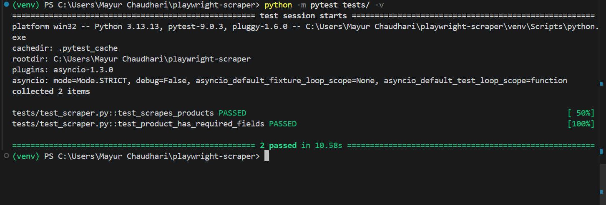

# Async JavaScript Site Scraper

A Python-based async web scraper built with Playwright for extracting
structured data from JavaScript-rendered pages — where standard HTTP
requests return empty responses.

## The Problem It Solves

Many modern product catalogs and directories render their content via
JavaScript. Standard HTTP scrapers (requests, urllib) return the raw
HTML before JS executes — resulting in empty or incomplete data.

Playwright controls a real Chromium browser, waits for the page to fully
render, then extracts clean structured data.

## What It Extracts

Scrapes product data from JS-rendered catalogs:

- Product name
- Price
- Availability status
- Star rating

Output is saved as structured JSON — ready for downstream processing,
database ingestion, or API consumption.

## Sample Output

```json
[
  {
    "name": "A Light in the Attic",
    "price": "£51.77",
    "availability": "In stock",
    "rating": "star-rating Three"
  },
  {
    "name": "Tipping the Velvet",
    "price": "£53.74",
    "availability": "In stock",
    "rating": "star-rating One"
  },
  {
    "name": "Soumission",
    "price": "£50.10",
    "availability": "In stock",
    "rating": "star-rating One"
  }
]
```

> Full sample output: [`sample_output.json`](sample_output.json)

## How It Works

```
Target URL (JS-rendered page)
          ↓
Playwright launches headless Chromium
          ↓
Waits for network idle state
          ↓
Selects all product elements
          ↓
Extracts name, price, availability, rating
          ↓
Outputs structured JSON
```

## Key Engineering Decisions

**Headless Chromium over requests** — handles JS rendering that standard
HTTP clients miss entirely.

**Network idle wait** — `wait_for_load_state('networkidle')` ensures the
page is fully loaded before extraction begins, preventing partial data.

**Selector-level error recovery** — each product is wrapped in
try/except so one malformed item doesn't crash the entire run.

**Config-driven target URL** — set via environment variable, new targets
require no code changes.

## Local Setup

```bash
git clone https://github.com/mayur-2100/playwright-scraper
cd playwright-scraper
python -m venv venv && source venv/bin/activate  # Windows: venv\Scripts\activate
pip install -r requirements.txt
playwright install chromium
```

## Usage

```bash
# Run with default target (books.toscrape.com)
python scraper.py

# Run with custom target
TARGET_URL=https://your-target-site.com python scraper.py
```

Output is saved to `output.json` and printed to terminal.

## Running Tests

```bash
pytest tests/ -v
```

Expected output:
```
PASSED tests/test_scraper.py::test_scrapes_products
PASSED tests/test_scraper.py::test_product_has_required_fields
```

## Screenshots

### Scraper running — terminal output


### Structured JSON output


### Tests passing


## Tech Stack

- Python 3.10+
- Playwright (async API)
- Chromium (headless browser)
- pytest + pytest-asyncio

## Notes

- Target site for demo: [books.toscrape.com](https://books.toscrape.com)
  — a publicly available scraping sandbox built for practice
- Always check a site's `robots.txt` and terms of service before
  scraping in production
